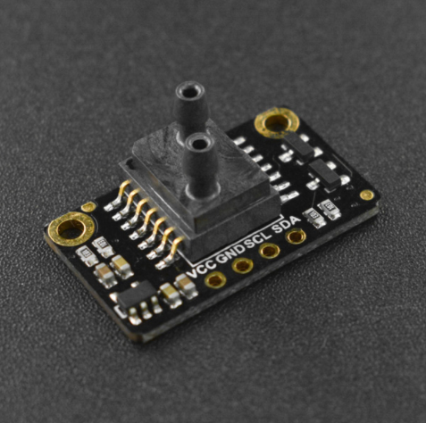

# DFRobot_LWLP
- [English Version](./README.md)

这是一款I2C接口的高精度差压传感器（压差传感器是一种用来测量两个压力之间差值的传感器，通常用于测量某一设备或部件前后两端的压差）。该传感器将高性能 MEMS 压力敏感芯片和专用调理芯片封装在管壳内，两个气路结构中压力互为参考，并采用独有算法实现对传感器进行多阶温度补偿，降低环境对输出的影响。<br>

注意：为了保准测量精度和传感器的寿命，请尽量在洁净气体中使用。传感器气嘴中不能进水，否则会损坏传感器。



## 产品链接 (https://www.dfrobot.com.cn/goods-2857.html)
    SEN0343:Fermion: LWLP5000差压传感器（±500pa）
	
## 目录

  * [概述](#概述)
  * [库安装](#库安装)
  * [方法](#方法)
  * [兼容性](#兼容性)
  * [历史](#历史)
  * [创作者](#创作者)

## 概述

     1.读取压差传感器的压差和温度值
   
## 库安装
要使用此库，请先下载库文件，并将其粘贴到\Arduino\libraries目录中，然后打开示例文件夹并在该文件夹中运行demo。

## 方法

```C++
  /**
   * @fn begin
   * @brief 初始化
   * @return 0(成功)或者错误码(失败)
   */
  int begin();
  /**
   * @fn getData
   * @brief 获取传感器数据
   * @return 数据集合 
   */
  sLwlp_t getData(void);
  /**
   * @fn getfilterData
   * @brief 获取滤波后的数据
   * @return 录波后的数据集合 
   */
  sLwlp_t getfilterData(void);

```

## 兼容性

主板               | 通过  | 未通过   | 未测试   | 备注
------------------ | :----------: | :----------: | :---------: | -----
Arduino uno        |      √       |              |             | 
Mega2560        |      √       |              |             | 
Leonardo        |      √       |              |             | 
ESP32           |      √       |              |             | 
micro:bit        |      √       |              |             | 


## 兼容性

- 2019/8/25 - Version 1.0.0 released.

## 创作者

Written by fengli(li.feng@dfrobot.com), 2019.8.25 (Welcome to our [website](https://www.dfrobot.com/))


